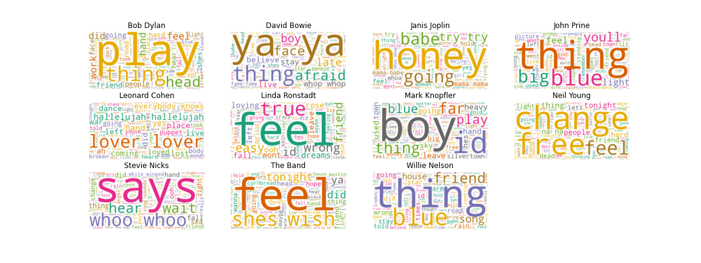
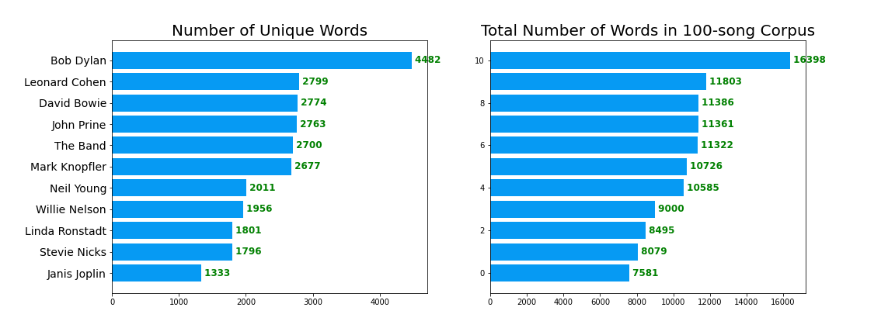
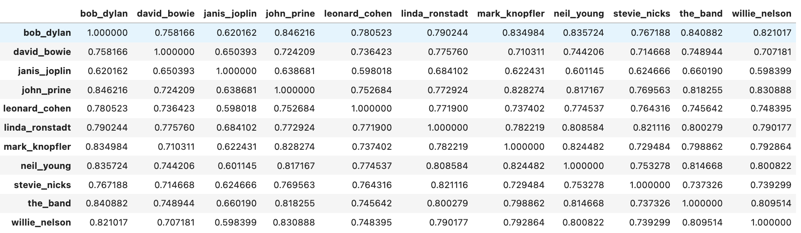
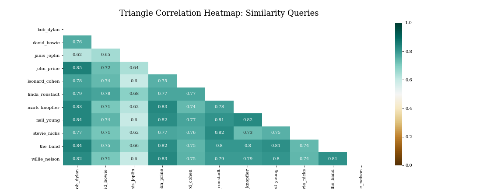
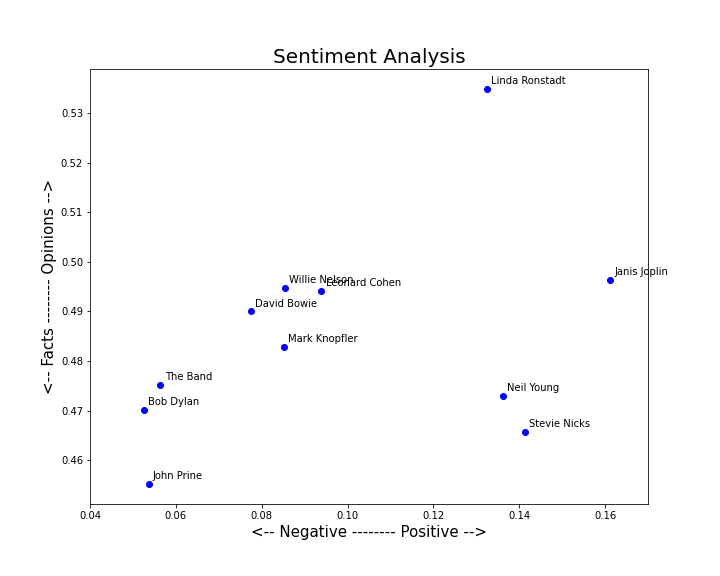

# **1000 Classic Rock Songs**

# Table of Contents

- [Executive Summary](#executive-summary)
- [Data Collection](#Data-Collection)
- [Data Cleaning & Pre-Processing](#Data-Cleaning--Pre-Processing)
- [EDA](#EDA)
- [Modeling](#modeling)
- [Next Steps](#Next-Steps)

# Executive Summary

For this project, I collected lyrics from the songs of twelve different classic rock musicians for the purpose of analyzing and comparing them using several different NLP methods. 

The NLP analyses so far performed on the data are: 

+ Number of words and number of unique words 
+ Cosine similarity (between bodies of work)
+ Sentiment analysis 


# Data Collection

*See notebook: [01_data_collection](https://github.com/EmFib/bob_dylan/blob/main/01_data_collection.ipynb)*

I collected song lyrics from Genius.com using their API and BeautifulSoup. Code for this section was heavily inspired by the tutorial [How to Scrape Song Lyrics: A Gentle Tutorial](https://medium.com/analytics-vidhya/how-to-scrape-song-lyrics-a-gentle-python-tutorial-5b1d4ab351d2) by Nick Pai, but I did have to make a couple edits and additions. 

The functions I used can be found in the data collection notebook. 


# Data Cleaning & Pre-Processing

*See notebook: [02_data_cleaning](projects/bob_dylan/02_data_cleaning.ipynb)*

First step was to load the lyrics files into a fresh notebook, which took some finesse. In the process, I realized that in order to load all the files and insert them into a DataFrame, I needed (a) to have pickle instead of text files and (b) to use a `try/except` statement. 

Alas, here is the hard-won, magical function for loading in my pickled lyrics files and inserting them into a dictionary called:

```
data = {}

for i, c in enumerate(musicians):
    file = open("./lyrics/" + c + ".pkl", "rb")
    data[c] = []
    while True:
        try:
            data[c].append(pickle.load(file))
        except EOFError:
            break
    file.close()
```

When I first loaded the data into the dictionary, the keys were the names of the artists and the values were their lyrics -- represented, however, as a list of their 100 songs. So I used a quick function called `combine_text` to convert each key from a list to one block of text. Then I converted the dictionary into a pandas DataFrame, with artists names as the indices and one column called `lyrics` and proceeded with cleaning the data, as described below. 

**Data cleaning steps on all text:**
* Make text all lower case
* Remove punctuation
* Remove numerical values
* Remove common non-sensical text (/n)
* Tokenize text
* Remove stop words

**More data cleaning after tokenization:**
* Stemming / lemmatization
* Parts of speech tagging
* Create bi-grams or tri-grams
* Deal with typos
* And more...

Details for the above processes can be found in the notebook. 

When I was finished cleaning (for the time being), the `lyrics` column in the final `data_clean` DataFrame had each artists' lyrics as one long string, ideally free of punctuation, special characters, weird non-sensical text, numeric values, and capital letters. I pickled this DataFrame as _data_clean.pkl_ to use for EDA and beyond. 

I also used scikit-learn's `CountVectorizer` to tokenize the text and remove stopwords. I pickled the CountVectorizer object as _dtm.pkl_ to use in future analysis. 

**Much of the code for cleaning and processing the data was borrowed from the _excellent_ [Natural Language Processing in Python](https://www.youtube.com/watch?v=xvqsFTUsOmc&t=1s&ab_channel=PyOhio) tutorial by Alice Zhao at PyOhio and the materials that came along with it. Please check out the [YouTube video](https://www.youtube.com/watch?v=xvqsFTUsOmc&t=1s&ab_channel=PyOhio) to learn more about NLP than you will from most formal education.** 


# EDA

*See notebook: [03 - EDA](projects/classic_rock_lyrics/03_EDA.ipynb)*

The EDA process consisted mostly of tracking and counting words used by different artists. 

Using the document-term, created a dictionary of the 30 most common words used by each musican. I then used the `Counter` dictionary subclass to find how many of the artists had the common words in their top 30, and I added these to the standard `CountVectorizer` English stop words to create a master stop words list. 

From the rest of the EDA process, I removed stop words for all counting so that I could count words without including the most common ones.

I wrote a function called `vectorized and plot` to show the most common words across the entire dataset: 




To see the most commons words for each artist, minus all the stop words, I created a new dictionary and printed all the words in their top 50 that were not stop words. 

I also created word clouds to visualize their most frequently-used words. (Again, stop words not included.)

Finally, I used `numpy` to find the total number of words and total number of _unique_ words used by each artist across each of their 100-song corpuses that I had scraped. Some interesting takeaways here are .... 



### _**Takeaways**_  
+ Bob Dylan, at 4482 words, has 60% more unique words throughout his music than the artist with the next greatest number of unique words - Leonard Cohen at 2799.
+ The average number of unique words across all 11 artistis is 2463, and Dylan's count is 82% greater.

# Modeling

The modeling I did included looking at cosine simlirities between the musicians and sentiment analysis across their bodies of work. 

&emsp; **Cosine Similarity** 

I used the `gensim` topic modeling library to find the cosine similarities between the different artists' lyrics. First, I put the ten 100-song catalogs for each artist into a corpus that included the lyrics for each artist into one list bulk set of words associated with that artist. From there, I transformed the corpus into the LSI space and indexed it using the deerwester index: 

```python
lsi = models.LsiModel(corpus, id2word=dictionary, num_topics=22)
index = similarities.MatrixSimilarity(lsi[corpus]) 
index.save('/tmp/deerwester.index')
index = similarities.MatrixSimilarity.load('/tmp/deerwester.index')
```

From there, I was able to run similarity queries against the corpus. Query objects first need to be turned into LSI vectors. I then run similarity query against the entire corpus, thereby producing a similarity score between the entry and each of the ten artists. Here is an example with a favorite Allen Ginsberg poem:

```python
# sample with a quote from an Allen Ginsberg poem

poem = "I had a moment of clarity, saw the feeling in the heart of things, walked out to the garden crying"

vec_bow = dictionary.doc2bow(poem.lower().split())
vec_lsi = lsi[vec_bow]    # convert query to LSI space 

sims = index[vec_lsi]  # perform a similarity query against the corpus 

sims = sorted(enumerate(sims), key=lambda item: -item[1])

for position, score in sims:     #match similarity scores to artist names 
    print(score, musicians[position][1])

Output: 
0.73411196 stevie_nicks
0.6174557 linda_ronstadt
0.52348113 neil_young
0.4642533 leonard_cohen
0.4258505 bob_dylan
0.3937433 the_band
0.3744713 willie_nelson
0.35524225 john_prine
0.2777136 mark_knopfler
0.2609053 david_bowie
0.20401922 janis_joplin
```

Once the system was up-and-running, I ran similarity queries for each artist's body of work against the other nine:

```python
artists = ['bob_dylan',
 'david_bowie',
 'janis_joplin',
 'john_prine',
 'leonard_cohen',
 'linda_ronstadt',
 'mark_knopfler',
 'neil_young',
 'stevie_nicks',
 'the_band',
 'willie_nelson']

 similarities = pd.DataFrame(index=artists)

for artist in artists: 
        
    artist_words = data['lyrics'][artist]
    
    artist_vec_bow = dictionary.doc2bow(artist_words.lower().split())
    artist_vec_lsi = lsi[artist_vec_bow]
    
    artist_sims = index[artist_vec_lsi]
    
    artist_sims_sorted = sorted(enumerate(artist_sims), key=lambda item: -item[1])
    
    for position, score in artist_sims_sorted:
    
        similarities.at[artist, musicians[position][1]] = float(score)

similarities = similarities.apply(pd.to_numeric)  # despite putting float in the above loop, still needed to use `pd.to_numeric` so that I could use the DF to create a heatmap
```
This produced a DataFrame with the similarity scores between each pair of artists...



... which i used to create this Seaborn heatmap: 



##### _Note: I chose to produce the heatmap using the `similarities` DataFrame as is instead of converting to `similarities.corr()` since it was already showing correlation scores between each pair of artists._ 

### _**Takeaways**_  

- The lyrics of songs by Bob Dylan, The Band, John Prine, Willie Nelson, and Neil Young exhibit the strongest similarities to one another. This is unsurprising for those familiar with their music, and many of them collaborated regularly and were heavily influenced by one another. Furthermore, Bob Dylan turned up high similarity scores with several of the other artists, perhaps as a result of his high number of unique words. (If you say a lot of words, there's a higher chance that some of it will align with otherwords!)
    -   **Cosine similarity score between Bob Dylan and John Prine is the highest: 0.85.** They are both known for their descriptive, personal, and compelling lyrics. Plus they've played together and have each expressed great respect for the other.
    - **Similarity score between Bob Dylan and The Band is 0.84.** The Band was Dylan's back-up band for many years and the collective is known to have written music together, so the mutual influence is inherent and now data science-proven! 
    - **Similarity score btween Bob Dylan and Neil Young is also 0.84.** Both cut their song-writing teeth during the late 60s and early 70s and have continuously been regarded as two of the most skilled and influential songwriters. 
- Janis Joplin's lyrics show to be the least similar to other artists, across the board. This is not surprising, but I do wonder about how this breaks down behind the `gensim` similarity query magic. All similarity scores between her and other artists were between 0.6 and 0.7, with three of them being 0.60. Janis's  highest score of 0.68 is with Linda Ronstadt -- another female artist.  `¯\_(ツ)_/¯`
- David Bowie's lyrics also exhibited low similarity scores with other artists, and his highest score - 0.78 - was also with Linda Ronstadt. 

&emsp; **Sentiment Analysis** 

I used the Python [TextBlob](https://textblob.readthedocs.io/en/dev/) library to evaluate the subjectivity (fact vs. opinion) and polarity (negative vs. positive) of each artist's 100-song catalog. 



Given that song-writing is assumed to be fictional story-telling, both of these metrics are somewhat less relevant for lyrical compositions than for other purposes, i.e. online reviews or news stories. They are also less salient because that we are taking each artist's body of work as a whole, as opposed to song-by-song or split up by timeline (song-specific sentiment analysis is something that I hope to do someday though!). I do find it interesting to see what data science has to say about how positive different musicians are according to their words of their songs. The facts <--> opinions scale, as well, is more thought-provoking than anything, but the question of whether someone's songs are more autobiographical or more fantastical is a hot topic amongst musicphiles, and the subjectivity score would provide relevant fodder for such a discussion, alas. So... 

### _**Takeaways**_  

##### _(to be taken with a grain of salt)_

+ The Band, Bob Dylan, and John Prine are once again clumped together far on the negative side of the spectrum. Not entirely surprising, but I'd be very curious to understand better what elements of their lyrics caused them to point in this direction. _(Does anyone know how best to gain this sort of insight??)_
+ The Band, Bob Dylan, and John Prine all have scores putting their lyrics much closer to the Facts side than the opinions side, with Prine have the highest facts-leaning score. I theorize that this is because they all have vivid, verbose descriptions in their work, which could sound closer to a true story. 
+ Surprisingly, Janis Joplin had the highest "positive score." 
+ Linda Ronstadt, Stevie Nicks, Janis - the only three female musicians in the bunch - all exhibit very high positivity scores (with only Neil Young being close to the gals in this regard) but have vastly different subjectvity scores. According to this analysis, Linda's lyrics are all opinions, Stevie's are more facts, and Janis is right in the middle.

##### _Note: This method for sentiment analysis was drawn from the _______ tutorial cited earlier._ 

# Next Steps 

With more time and a bigger scope, there's a whole lot more I would like to do with the Reddit database and this concept. First and foremost:

+ Incorporate other NLP modeling techniques, such as spaCy and/or Word2vec.
+ Do some text classification modeling, i.e. feed in words and let a model tell you which artist they belong to. This would likely be a Logistic Regression model but I'd also like to run some Tree/Ensemble models. 
+ Scrape lyrics song-by-song so that I could compare the differents works of the same artist. I could compare Bob Dylan's 60s music to his 70s music, for example! 
+ Gather more data - more artists, more songs!
+ _What other analysis or modeling would you do using the lyrics of ten different classic rock artists??_ 

# Citations 

