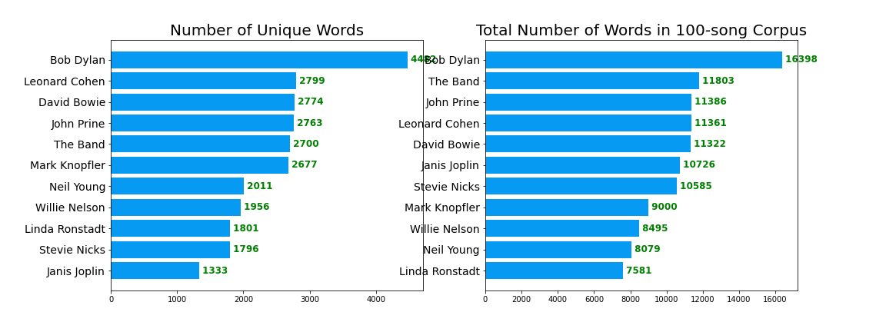

# **TALK THE TALK, WALK THE WALK**

## Table of Contents

- [Executive Summary](#Executive-Summary)
- [Data Collection](#Data-Collection)
- [Data Cleaning & Pre-Processing](#Data-Cleaning-&-Pre-Processing)
- [EDA](#EDA)
- [Modeling](#Modeling)
- [Evaluation & Analysis](#Evaluation-&-Analysis)
- [Conclusion & Recommendations](#Conclusion-&-Recommendations)
- [Next Steps & Future work](#Next-Steps-&-Future-work)


## Executive Summary

For this project, I collected lyrics from the songs of twelve different classic rock musicians for the purpose of analyzing and comparing them using several different NLP methods. 

The NLP analyses so far performed on the data are: 

+ Number of words and number of unique words 
+ (feature analysis)
+ Cosine similarity (between bodies of work)
+ Sentiment analysis 


## Data Collection

*See notebook: [01_data_collection](projects/bob_dylan/01_data_collection.ipynb)*

I collected song lyrics from Genius.com using their API and BeautifulSoup. Code for this section was heavily inspired by the tutorial [How to Scrape Song Lyrics: A Gentle Tutorial](https://medium.com/analytics-vidhya/how-to-scrape-song-lyrics-a-gentle-python-tutorial-5b1d4ab351d2) by Nick Pai, but I did have to make a couple edits and additions. 

The functions I used can be found in the data collection notebook. 


## Data Cleaning & Pre-Processing

*See notebook: [02_data_cleaning](projects/bob_dylan/02_data_cleaning.ipynb)*

First step was to load the lyrics files into a fresh notebook, which took some finesse. In the process, I realized that in order to load all the files and insert them into a DataFrame, I needed (a) to have pickle instead of text files and (b) to use a `try/except` statement. 

Alas, here is the hard-won, magical function for loading in my pickled lyrics files and inserting them into a dictionary called:

```
data = {}

for i, c in enumerate(musicians):
    file = open("./lyrics/" + c + ".pkl", "rb")
    data[c] = []
    while True:
        try:
            data[c].append(pickle.load(file))
        except EOFError:
            break
    file.close()
```

When I first loaded the data into the dictionary, the keys were the names of the artists and the values were their lyrics -- represented, however, as a list of their 100 songs. So I used a quick function called `combine_text` to convert each key from a list to one block of text. Then I converted the dictionary into a pandas DataFrame, with artists names as the indices and one column called `lyrics` and proceeded with cleaning the data, as described below. 

**Data cleaning steps on all text:**
* Make text all lower case
* Remove punctuation
* Remove numerical values
* Remove common non-sensical text (/n)
* Tokenize text
* Remove stop words

**More data cleaning after tokenization:**
* Stemming / lemmatization
* Parts of speech tagging
* Create bi-grams or tri-grams
* Deal with typos
* And more...

Details for the above processes can be found in the notebook. 

When I was finished cleaning (for the time being), the `lyrics` column in the final `data_clean` DataFrame had each artists' lyrics as one long string, ideally free of punctuation, special characters, weird non-sensical text, numeric values, and capital letters. I pickled this DataFrame as _data_clean.pkl_ to use for EDA and beyond. 

I also used scikit-learn's `CountVectorizer` to tokenize the text and remove stopwords. I pickled the CountVectorizer object as _dtm.pkl_ to use in future analysis. 

**Much of the code for cleaning and processing the data was borrowed from the _excellent_ [Natural Language Processing in Python](https://www.youtube.com/watch?v=xvqsFTUsOmc&t=1s&ab_channel=PyOhio) tutorial by Alice Zhao at PyOhio and the materials that came along with it. Please check out the [YouTube video](https://www.youtube.com/watch?v=xvqsFTUsOmc&t=1s&ab_channel=PyOhio) to learn more about NLP than you will from most formal education.** 


## EDA

*See notebook: [03 - EDA](projects/classic_rock_lyrics/03_EDA.ipynb)*

The EDA process consisted mostly of tracking and counting words used by different artists. 

Using the document-term, created a dictionary of the 30 most common words used by each musican. I then used the `Counter` dictionary subclass to find how many of the artists had the common words in their top 30, and I added these to the standard `CountVectorizer` English stop words to create a master stop words list. 

From the rest of the EDA process, I removed stop words for all counting so that I could count words without including the most common ones.

I wrote a function called `vectorized and plot` to show the most common words across the entire dataset: 


To see the most commons words for each artist, minus all the stop words, I created a new dictionary and printed all the words in their top 50 that were not stop words. 

I also created word clouds to visualize their most frequently-used words. (Again, stop words not included.)

Finally, I used `numpy` to find the total number of words and total number of _unique_ words used by each artist across each of their 100-song corpuses that I had scraped. Some interesting takeaways here are .... 




## Modeling

The modeling I did included looking at cosine simlirities between the musicians and sentiment analysis across their bodies of work. 


## Evaluation & Analysis

I then used this fit pipeline to execute my `find_most_important_words` and `plot_most_important_words` functions. Plotting the top 25 most important words from each subreddit yielded the following figures:


This plot clearly show the most important words in classifying these subreddits, which speaks directly to the problem statement in my executive summary. This, in turn, performs the task for which I was hoping: drawing out the trends of the discussion in the subreddit.

Importantly, simply for the purposes of visualization, I used Principle Component Analysis to reduce my 14,594 features down to two dimensions so that the vectorized country-rock DataFrame could be represented in a scatter plot.


The purpose of this plot is merely to represent how to the two classes, while overlapping, are indeed somewhat distinct from each other. This bolsters the analysis by further reinforcing that the word importances being pulled out of the model are distinctive to that subreddit as opposed to being more general.

## Conclusion & Recommendations

And there you go! If you wish to know what's on the hearts and minds of fans of country and rock music; if you wish to speak to what is resonating with them; to write salient songs; to market and advertise profitably; to book shows that will sell out: start with this list of words and names.

## Next Steps & Future work

With more time and a bigger scope, there's a whole lot more I would like to do with the Reddit database and this concept. First and foremost:

+ Incorporate other NLP modeling techniques, such as spaCy and/or Word2vec.
+ Run additional Tree/Ensemble models and find feature importances to see whether they mimic the coefficients in the Logistic Regression model.
+ Examine features beyond word use, e.g. post length (in modeling) and sentiment analysis.
+ Gather more data - more subreddits, more genres, more posts!

## Acknowledgements

While I offer ample credit throughout my notebooks where I received help from others, I want to give an additional shoutout here to the people without whom this project would never have come to completion:

+ Charlie Rice
+ Hovanes Gasparian
+ Prasoon Karmacharya
+ John D. Hazard
+ James Opacich
+ Heather Johansen
+ Jesse Tao
+ Kira Helm
+ CM Vigil April

All these people spent time, care, energy, lifeblood to help me get here. Thank you.
